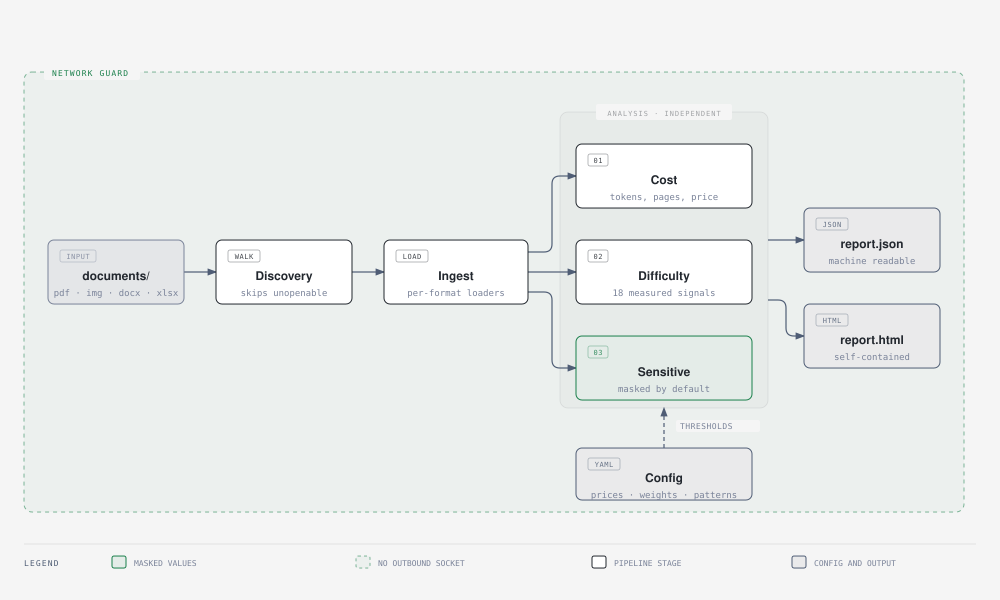

<div align="center">
  <picture>
    <source media="(prefers-color-scheme: dark)" srcset=".github/images/logo-dark.svg">
    <source media="(prefers-color-scheme: light)" srcset=".github/images/logo-light.svg">
    
  </picture>
</div>

<div align="center">
  <h3>Offline document audit: LLM cost, extraction readiness, and personal data.</h3>
</div>

<div align="center">
  <a href="https://opensource.org/licenses/MIT"></a>
  
  
  
</div>

<br>

Point complydoc at a folder of business documents and it answers three questions: what they
would cost to process with an LLM, how ready they are to extract data from, and what personal
or financial information they hold. It is a diagnostic you run before buying a document
automation system, not a pipeline you run in production.

**It makes no network calls.** `offline.py` replaces the standard library's outbound socket
and DNS entry points before any file is opened, and the test suite runs a full audit with
that guard armed. Every report records whether it was active.

<br>

<div align="center">
  <picture>
    <source media="(prefers-color-scheme: dark)" srcset=".github/images/complydoc-architecture-dark.svg">
    <source media="(prefers-color-scheme: light)" srcset=".github/images/complydoc-architecture.svg">
    
  </picture>
</div>

## Install

```bash
uv tool install git+https://github.com/duartecaldascardoso/complydoc
```

If `complydoc: command not found`, add uv's bin directory to your shell:

```bash
echo 'export PATH="$HOME/.local/bin:$PATH"' >> ~/.zshrc && exec zsh
```

OCR and local name detection are optional extras — a large download, and a diagnostic
run is still useful without them. To install both:

```bash
uv tool install --force --reinstall --with rapidocr-onnxruntime --with spacy \
  git+https://github.com/duartecaldascardoso/complydoc
uv pip install --python "$(uv tool dir)/complydoc/bin/python" \
  https://github.com/explosion/spacy-models/releases/download/en_core_web_sm-3.8.0/en_core_web_sm-3.8.0-py3-none-any.whl
```

The second line puts the spaCy model inside the tool's own environment, which
`spacy download` cannot do because it shells out to pip and a uv tool environment has
none. `complydoc doctor` says which extras it can see.

## Use

```bash
cd ~/invoices
complydoc
```

That audits the folder you are standing in and writes `.complydoc/complydoc.html` and
`.complydoc/complydoc.json`, printing both as clickable links. The output directory is
hidden so a second run does not pick up the first run's reports.

```bash
complydoc audit ~/invoices --monthly-volume 2500  # extrapolate to a monthly bill
complydoc audit ~/invoices --save-text ./text     # keep the text it read, one file per document
complydoc sensitive ~/invoices                    # only the identifier scan
complydoc readiness ~/invoices                    # only the extraction signals
complydoc cost ~/invoices                         # only the price estimate
complydoc models --new 15                         # the newest models it can price against
complydoc extractors                              # libraries that can read a text layer
complydoc engines                                 # local OCR engines
complydoc doctor                                  # what is installed
```

Inputs: PDF (native and scanned), PNG, JPG, TIFF, BMP, DOCX, XLSX. Folders are recursed and
anything that cannot be opened is skipped and reported rather than failing the run.

### Options worth knowing

| Flag | What it does |
| --- | --- |
| `--monthly-volume N` | Extrapolates the folder's cost to a monthly and annual bill |
| `--model <id>` | Prices one model instead of the default set; repeatable |
| `--save-text <dir>` | Writes the extracted text out, one file per document |
| `--sample N` | Audits N documents instead of all of them, keeping each file type's share |
| `--password <pw>` | Tried on encrypted PDFs |
| `--reveal` | Prints identifiers in full instead of masked, and stamps the report |
| `--no-ocr` | Skips reading scanned pages. Faster, and finds less |
| `--no-page-images` / `--no-extracted-text` | Leave the document content out of the report |
| `--compare-extractor <id>` | Reads every page with a second library too, and keeps what each read |
| `--compare-ocr-engine <id>` | The same for OCR engines, which disagree far more than the extractors |
| `--jobs N` | Fixes the worker count. The default reads the folder size and decides |
| `--print-json` | Puts the JSON on stdout and nothing else |

`--sample` changes what the report finds, so it says on its front page that it read a sample
and how many documents it skipped. The choice is deterministic: two runs of one folder pick
the same documents, so their reports compare.

> [!IMPORTANT]
> The report carries the text read off each page, and a picture of each page, so that you can
> check what was extracted against what was there. That means the file holds the identifiers
> it masks elsewhere. Treat it as you would treat the documents. `--no-extracted-text` and
> `--no-page-images` produce a report with no document content in it.

## The report

One self-contained HTML file — no server, no network, no assets to load — behind a tab bar.

| Page | Answers |
| --- | --- |
| **Summary** | Cost per 1,000 documents, AI readiness, how long processing takes, sensitive items per document |
| **Cost** | Every model across three processing architectures, filterable by provider |
| **Security** | What personal data is in there, by category and by occurrence, sortable by severity |
| **Documents** | A file browser: every page beside the text read off it, with its signals a tab away |

The JSON alongside it is sorted and stable, so two runs can be compared with `diff`. It
carries a schema version and a digest of the config that produced it.

## What it measures

**Cost.** Page count, dimensions, DPI, text layer coverage, text tokens from a real
tokenizer, and vision tokens at each resolution. Vision formulas differ by provider — some
tile the image, some use width by height, some charge a flat count — so all three shapes live
in configuration, not in code.

Three architectures are compared: the **text layer** alone, **text plus local OCR**, and
**vision**. Cost alone favours the text layer, but it only reaches documents that have one,
so the number of documents each approach can serve is shown beside every figure. Where a
provider publishes a batch price, that is shown too.

Input cost only — output depends on your prompt, which complydoc cannot know. Prices are
either verified against the provider's own page or imported from a catalogue, and the report
says which; an imported price is never presented as a checked one.

**Time.** Reading and analysing is measured on the machine that runs the audit, so the report
quotes a rate it observed rather than one it assumed: a breakdown by stage, per document, per
page, and the OCR throughput that dominates a folder of scans — then what that rate means for
100, 1,000, 10,000 and 100,000 documents. That is the work before anything reaches a model.
Time *on* the model is not estimated, because complydoc cannot benchmark a hosted endpoint
offline; add `input_tokens_per_second` to a model from your own benchmark and it will.

**Readiness.** Nineteen signals, each with a measured value, a rating, and one sentence on
why it matters. Text layer and coverage, image proportion, garbled characters, tables and
merged cells, columns, rotation and skew, scan DPI, fonts, date consistency, page sizes,
language, encryption, and form fields — which count as a *positive* signal. A high score
means a document that is ready to process as it stands.

The weighted score exists only because every weight is visible in configuration and printed
beside its row. Signals that cannot be measured are excluded rather than counted as failures.

**Personal data.** Detection is not tied to one jurisdiction. Every national identifier is
checksum-validated, so enabling them all does not flood the report:

| Region | Identifiers |
| --- | --- |
| UK | National Insurance, sort code, account number, postcode, address, phone, VAT, UTR |
| US | Social Security number, EIN, ABA routing number |
| IE · NL · PT · ES · FR · DE | PPS, BSN, NIF, DNI/NIE, NIR, Steuer-ID |
| EU | VAT numbers, per country length rules |
| International | IBAN, payment cards, email, dates of birth, names and organisations |

Pages with no readable text are listed by number and excluded from the counts, so a page
nobody could read stays distinguishable from a page with nothing on it. Every mark on the
page layout explains, on hover, what was found and why it matters.

> [!IMPORTANT]
> Values are masked in the findings — at most the last four characters. `--reveal` unmasks
> them and stamps the report; categories configured as `never_reveal` stay masked even then.

## Configuration

Everything a reader might want to disagree with — a price, a token formula, a signal weight,
a rating threshold, a detection pattern — lives in YAML, not in code. Point `--config-dir` at
a copy to change any of it.

| File | Contents |
| --- | --- |
| `pricing.yaml` | Model prices, how many to compare per provider, vision formulas |
| `model_prices.json` | The current first-party models, available to `--model` |
| `readiness.yaml` | Signal weights, rating thresholds, scoring rules |
| `sensitive.yaml` | Patterns, validators, regions, severities, masking rules |

Three providers are compared by default, three models each, chosen from the newest the
catalogue knows about. To reach any of the others:

```bash
complydoc models --new 15                     # the most recently released
complydoc models gpt                          # or search
complydoc audit ~/invoices -m gpt-6-astra     # and price against one by name
```

## From an agent

```bash
complydoc audit ./invoices --print-json | jq '.aggregate'
```

`--print-json` puts the report on stdout and nothing else; progress goes to stderr. complydoc
ships an agent skill, so one install gives you the tool and the instructions for driving it:

```bash
complydoc skill --install     # → ~/.claude/skills/complydoc/SKILL.md
```

## Contributing

Architecture, how to add a signal, the test fixtures, and the release process are in
[CONTRIBUTING.md](CONTRIBUTING.md). The changelog ships with the package, at
[`src/complydoc/CHANGELOG.md`](src/complydoc/CHANGELOG.md).

## Licence

MIT
